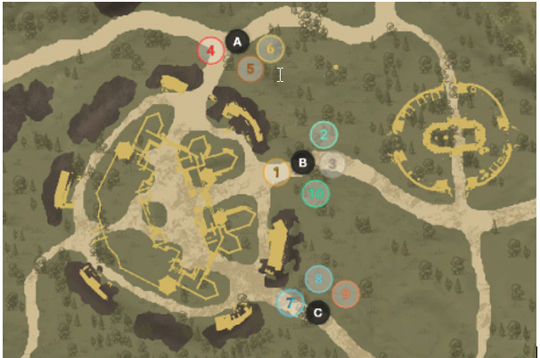
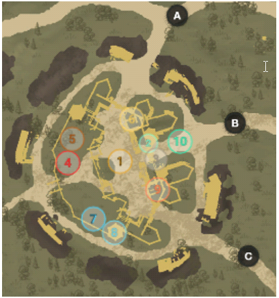

# Modern Defense Strat

# Defaults

A

- Group 4 – anchor group consists of 2 healers, 1 heavy, 2 dps (one dps being void/ice); if A is empty 1 healer and 1 heavy are the &quot;anchors&quot; they will call # of enemies and are free to call for group 4 if there is five enemies, group 4 &amp; 5 is there is ten enemies or they can call A defaults which means group 4-6 should be on A; If A needs more help they will call the # of flex groups needed
- Group 7 – anchor group consists of 2 healers, 1 heavy, 2 dps (one dps being void/ice); if C is empty 1 healer and 1 heavy are the &quot;anchors&quot; they will call # of enemies and are free to call for group 7 if there is five enemies, group 7 &amp; 8 is there is ten enemies or they can call C defaults which means group 7-9 should be on C; If C needs more help they will call the # of flex groups needed
- Group 1 – consists of 1 healer &amp; 1 heavy that are &quot;anchors&quot; the other 3 members are dps and considered flex 1; B calls how many are there but let the main shot caller say which groups go where
- Group 2 – default B, but known as flex 2
- Group 3 – default B, but known as flex 3
- Group 10 – dex users / one shot builds, maybe one healer; rotate as needed
- Main shot caller will listen to number called by A &amp; C anchors and will rotate flex as needed or call for some of A &amp; C defaults to help B if needed
- If the main shot caller said every go to defaults it would like the picture above
- Main shot caller relied on good information from point callers to ensure we had the numbers where they were
- The anchors for A &amp; C (healer and heavy) were the ones to grab repair parts, 300 parts are available as the match starts and as you die they would make sure to grab them periodically

# Comp (server dependent)

- 11-13 healers; typically 12 on defence
  - 1 in each group and 2 in the anchor groups of A &amp; C
- 0-3 dex; they hated dex for a long time but started slotting 1-2 muskets and maybe 1 bow at the end
- 3-5 FS/IG mages
- 9-12 VG/IG mages (2-3 were heavy and on point)
- 16-20 Bruiser (with 2-3 heavy)
- 0-4 One shot builds (bb/sns, hammer/sns, hatchet/sns, etc)

# Fort

- Group 1 – would stay on point 100% if there was influence
- Group 2 &amp; 3 – would fight up top or around point if needed, as well as assist on front respawns if close
- Group 4 &amp; 5 – responsible for back ramparts and A anchors would try and keep that door up as much as possible and maybe repair front gates if able
- Group 6 – front respawns
- Group 7 &amp; 8 - responsible for back ramparts and C anchors would try and keep that door up as much as possible and maybe repair front gates if able
- Group 9 – front respawns
- Group 10 – upper ramparts killing range &amp; healers
- The back ramparts seem to have the most people so we had two groups at each
- If there was point presence some people would leave respawns as needed to get influence down but you never want to leave respawns unattended (fort is taken with 1-2 good respawns kills especially later on with longer respawns)
